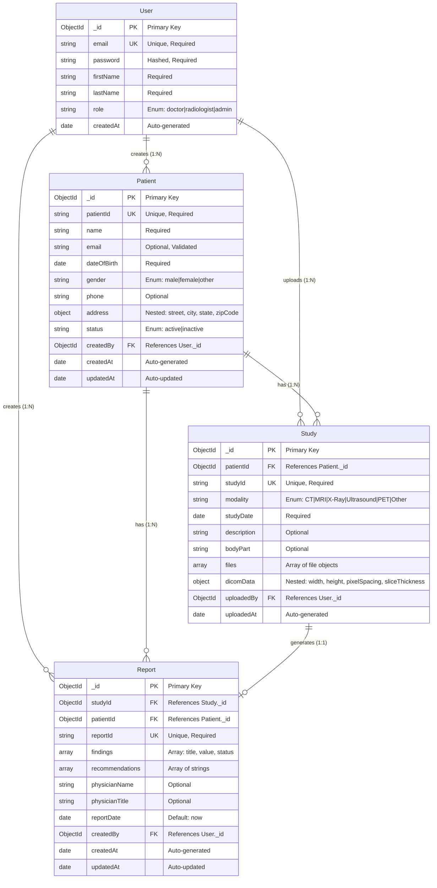

# Database Entity Relationship Diagram (ERD)

## Visual ERD Diagram

The following Mermaid diagram shows the relationships between all database collections:



---

## Relationship Details

### 1. User → Patient (One-to-Many)
```
User (1) ────────< (N) Patient
```
- **Foreign Key**: `Patient.createdBy` → `User._id`
- **Description**: Each doctor can create multiple patients
- **Business Rule**: Patients are isolated per user (doctor)

### 2. User → Study (One-to-Many)
```
User (1) ────────< (N) Study
```
- **Foreign Key**: `Study.uploadedBy` → `User._id`
- **Description**: Each user can upload multiple DICOM studies
- **Business Rule**: Studies are isolated per user

### 3. User → Report (One-to-Many)
```
User (1) ────────< (N) Report
```
- **Foreign Key**: `Report.createdBy` → `User._id`
- **Description**: Each doctor/radiologist can create multiple reports
- **Business Rule**: Reports are isolated per user

### 4. Patient → Study (One-to-Many)
```
Patient (1) ────────< (N) Study
```
- **Foreign Key**: `Study.patientId` → `Patient._id`
- **Description**: Each patient can have multiple imaging studies
- **Business Rule**: Studies must belong to a patient

### 5. Patient → Report (One-to-Many)
```
Patient (1) ────────< (N) Report
```
- **Foreign Key**: `Report.patientId` → `Patient._id`
- **Description**: Each patient can have multiple medical reports
- **Business Rule**: Reports must be associated with a patient

### 6. Study → Report (One-to-One)
```
Study (1) ────────| (1) Report
```
- **Foreign Key**: `Report.studyId` → `Study._id`
- **Description**: Each study generates one medical report
- **Business Rule**: One report per study (can be updated)

---

## Entity Attributes Summary

### User Entity
- **Primary Key**: `_id` (ObjectId)
- **Unique Fields**: `email`
- **Required Fields**: `email`, `password`, `firstName`, `lastName`
- **Optional Fields**: `role` (defaults to 'doctor')
- **Computed Fields**: None
- **Indexes**: `email` (unique)

### Patient Entity
- **Primary Key**: `_id` (ObjectId)
- **Unique Fields**: `patientId`
- **Required Fields**: `name`, `patientId`, `dateOfBirth`, `gender`, `createdBy`
- **Optional Fields**: `email`, `phone`, `address`, `status` (defaults to 'active')
- **Computed Fields**: `updatedAt` (auto-updated)
- **Indexes**: `patientId` (unique), `name` + `email` (text), `createdBy`

### Study Entity
- **Primary Key**: `_id` (ObjectId)
- **Unique Fields**: `studyId`
- **Required Fields**: `patientId`, `studyId`, `modality`, `studyDate`
- **Optional Fields**: `description`, `bodyPart`, `files[]`, `dicomData`, `uploadedBy`
- **Computed Fields**: `uploadedAt` (auto-generated)
- **Indexes**: `patientId`, `studyId` (unique), `studyDate` (descending)

### Report Entity
- **Primary Key**: `_id` (ObjectId)
- **Unique Fields**: `reportId`
- **Required Fields**: `studyId`, `patientId`, `reportId`, `findings[]`
- **Optional Fields**: `recommendations[]`, `physicianName`, `physicianTitle`, `createdBy`
- **Computed Fields**: `reportDate` (defaults to now), `updatedAt` (auto-updated)
- **Indexes**: `studyId`, `patientId`, `reportId` (unique), `reportDate` (descending)

---

## Data Integrity Rules

1. **Referential Integrity**
   - `Patient.createdBy` must reference an existing `User._id`
   - `Study.patientId` must reference an existing `Patient._id`
   - `Study.uploadedBy` must reference an existing `User._id` (if provided)
   - `Report.studyId` must reference an existing `Study._id`
   - `Report.patientId` must reference an existing `Patient._id`
   - `Report.createdBy` must reference an existing `User._id` (if provided)

2. **Uniqueness Constraints**
   - `User.email` must be unique
   - `Patient.patientId` must be unique
   - `Study.studyId` must be unique
   - `Report.reportId` must be unique

3. **Cascade Rules**
   - **Deleting a User**: Should handle orphaned records (patients, studies, reports)
   - **Deleting a Patient**: Should handle associated studies and reports
   - **Deleting a Study**: Should handle associated report
   - **Note**: Currently, cascade deletion is not implemented - consider adding it

---

## How to View the Mermaid Diagram

### Option 1: GitHub/GitLab
- The Mermaid diagram will render automatically when viewing this file on GitHub or GitLab

### Option 2: VS Code
- Install the "Markdown Preview Mermaid Support" extension
- Open this file and use the Markdown preview

### Option 3: Online Mermaid Editor
1. Go to https://mermaid.live/
2. Copy the Mermaid code from the diagram above
3. Paste it into the editor
4. View the rendered diagram

### Option 4: Mermaid CLI
```bash
npm install -g @mermaid-js/mermaid-cli
mmdc -i DATABASE_ERD.md -o database_erd.png
```

---

## Database Design Principles

1. **User Isolation**: All data is scoped to the user who created it (`createdBy` or `uploadedBy`)
2. **Normalization**: Data is normalized to reduce redundancy
3. **Indexing**: Strategic indexes on frequently queried fields
4. **Validation**: Field-level validation ensures data integrity
5. **Timestamps**: Automatic tracking of creation and update times
6. **Soft Deletes**: Consider adding `deletedAt` field for soft deletes (currently not implemented)

---

## Future Enhancements

1. **Audit Trail**: Add `auditLog` collection to track all changes
2. **Soft Deletes**: Add `deletedAt` field to all collections
3. **Versioning**: Add version tracking for reports
4. **Tags/Categories**: Add tagging system for patients and studies
5. **Attachments**: Add file attachments to reports
6. **Comments**: Add comments/notes system
7. **Sharing**: Add sharing permissions between users

---

*Last Updated: Based on current Mongoose schema definitions*

