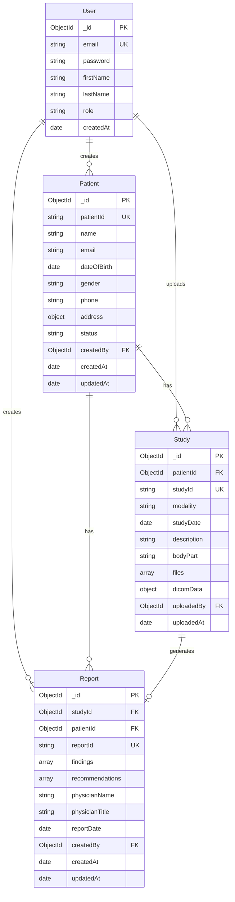

# Database Schema Documentation

## Overview

This document describes the MongoDB database schema for the Medical DICOM Viewer application. The database uses Mongoose ODM and consists of four main collections: **Users**, **Patients**, **Studies**, and **Reports**.

---

## Database: `medical_dicom` (or as configured in MongoDB URI)

---

## Collections

### 1. **Users Collection**

Stores user accounts (doctors, radiologists, administrators).

#### Schema Structure

```javascript
{
  _id: ObjectId,                    // MongoDB auto-generated ID
  email: String,                   // Required, Unique, Lowercase, Validated
  password: String,                 // Required, Min 6 chars, Hashed with bcrypt
  firstName: String,                // Required, Trimmed
  lastName: String,                // Required, Trimmed
  role: String,                    // Enum: ['doctor', 'radiologist', 'admin'], Default: 'doctor'
  createdAt: Date                  // Auto-generated timestamp
}
```

#### Field Details

| Field | Type | Required | Unique | Constraints | Description |
|-------|------|----------|--------|------------|-------------|
| `_id` | ObjectId | Yes | Yes | Auto-generated | Primary key |
| `email` | String | Yes | Yes | Lowercase, Email format | User's email address |
| `password` | String | Yes | No | Min 6 chars, Hashed | User's password (bcrypt hashed) |
| `firstName` | String | Yes | No | Trimmed | User's first name |
| `lastName` | String | Yes | No | Trimmed | User's last name |
| `role` | String | No | No | Enum: doctor/radiologist/admin | User role, defaults to 'doctor' |
| `createdAt` | Date | No | No | Auto-generated | Account creation timestamp |

#### Indexes
- `email` (unique index)

#### Methods
- `comparePassword(candidatePassword)` - Compares plain text password with hashed password
- `toJSON()` - Removes password from JSON output

#### Hooks
- `pre('save')` - Automatically hashes password before saving

---

### 2. **Patients Collection**

Stores patient information and demographics.

#### Schema Structure

```javascript
{
  _id: ObjectId,                    // MongoDB auto-generated ID
  name: String,                      // Required, Trimmed
  patientId: String,                 // Required, Unique, Trimmed
  email: String,                     // Optional, Lowercase, Email format
  dateOfBirth: Date,                 // Required
  gender: String,                    // Required, Enum: ['male', 'female', 'other']
  phone: String,                     // Optional, Trimmed
  address: {                         // Optional nested object
    street: String,
    city: String,
    state: String,
    zipCode: String
  },
  status: String,                   // Enum: ['active', 'inactive'], Default: 'active'
  createdBy: ObjectId,               // Required, References User._id
  createdAt: Date,                   // Auto-generated timestamp
  updatedAt: Date                    // Auto-updated timestamp
}
```

#### Field Details

| Field | Type | Required | Unique | Constraints | Description |
|-------|------|----------|--------|------------|-------------|
| `_id` | ObjectId | Yes | Yes | Auto-generated | Primary key |
| `name` | String | Yes | No | Trimmed | Patient's full name |
| `patientId` | String | Yes | Yes | Trimmed | Unique patient identifier |
| `email` | String | No | No | Lowercase, Email format | Patient's email address |
| `dateOfBirth` | Date | Yes | No | Valid date | Patient's date of birth |
| `gender` | String | Yes | No | Enum: male/female/other | Patient's gender |
| `phone` | String | No | No | Trimmed | Patient's phone number |
| `address.street` | String | No | No | - | Street address |
| `address.city` | String | No | No | - | City |
| `address.state` | String | No | No | - | State/Province |
| `address.zipCode` | String | No | No | - | ZIP/Postal code |
| `status` | String | No | No | Enum: active/inactive | Patient status, defaults to 'active' |
| `createdBy` | ObjectId | Yes | No | References User | ID of user who created this patient |
| `createdAt` | Date | No | No | Auto-generated | Record creation timestamp |
| `updatedAt` | Date | No | No | Auto-updated | Last update timestamp |

#### Indexes
- `patientId` (unique index)
- `name`, `email` (text index for search)
- `createdBy` (index for filtering by user)

#### Hooks
- `pre('save')` - Automatically updates `updatedAt` before saving

---

### 3. **Studies Collection**

Stores DICOM study information and file metadata.

#### Schema Structure

```javascript
{
  _id: ObjectId,                    // MongoDB auto-generated ID
  patientId: ObjectId,              // Required, References Patient._id
  studyId: String,                  // Required, Unique, Trimmed
  modality: String,                  // Required, Enum: ['CT', 'MRI', 'X-Ray', 'Ultrasound', 'PET', 'Other']
  studyDate: Date,                  // Required, Default: Date.now
  description: String,              // Optional, Trimmed
  bodyPart: String,                 // Optional, Trimmed
  files: [{                          // Array of file objects
    fileName: String,                // Required
    fileSize: Number,                // Required (bytes)
    filePath: String,                // Optional
    uploadedAt: Date                 // Auto-generated timestamp
  }],
  dicomData: {                       // Optional nested object
    width: Number,
    height: Number,
    pixelSpacing: String,
    sliceThickness: Number
  },
  uploadedBy: ObjectId,              // Optional, References User._id
  uploadedAt: Date                  // Auto-generated timestamp
}
```

#### Field Details

| Field | Type | Required | Unique | Constraints | Description |
|-------|------|----------|--------|------------|-------------|
| `_id` | ObjectId | Yes | Yes | Auto-generated | Primary key |
| `patientId` | ObjectId | Yes | No | References Patient | Associated patient ID |
| `studyId` | String | Yes | Yes | Trimmed | Unique study identifier |
| `modality` | String | Yes | No | Enum: CT/MRI/X-Ray/Ultrasound/PET/Other | Imaging modality type |
| `studyDate` | Date | Yes | No | Valid date | Date when study was performed |
| `description` | String | No | No | Trimmed | Study description |
| `bodyPart` | String | No | No | Trimmed | Anatomical body part imaged |
| `files[].fileName` | String | Yes | No | - | Name of DICOM file |
| `files[].fileSize` | Number | Yes | No | - | File size in bytes |
| `files[].filePath` | String | No | No | - | Server file path (if stored) |
| `files[].uploadedAt` | Date | No | No | Auto-generated | File upload timestamp |
| `dicomData.width` | Number | No | No | - | Image width in pixels |
| `dicomData.height` | Number | No | No | - | Image height in pixels |
| `dicomData.pixelSpacing` | String | No | No | - | Pixel spacing information |
| `dicomData.sliceThickness` | Number | No | No | - | Slice thickness (for 3D studies) |
| `uploadedBy` | ObjectId | No | No | References User | ID of user who uploaded the study |
| `uploadedAt` | Date | No | No | Auto-generated | Study upload timestamp |

#### Indexes
- `patientId` (index for filtering by patient)
- `studyId` (unique index)
- `studyDate` (descending index for sorting)

---

### 4. **Reports Collection**

Stores medical reports generated from studies.

#### Schema Structure

```javascript
{
  _id: ObjectId,                    // MongoDB auto-generated ID
  studyId: ObjectId,                // Required, References Study._id
  patientId: ObjectId,              // Required, References Patient._id
  reportId: String,                 // Required, Unique, Trimmed
  findings: [{                      // Array of finding objects
    title: String,                  // Required
    value: String,                  // Required
    status: String                   // Enum: ['normal', 'warning', 'critical'], Default: 'normal'
  }],
  recommendations: [String],         // Array of recommendation strings
  physicianName: String,             // Optional, Trimmed
  physicianTitle: String,            // Optional, Trimmed
  reportDate: Date,                  // Default: Date.now
  createdBy: ObjectId,               // Optional, References User._id
  createdAt: Date,                   // Auto-generated timestamp
  updatedAt: Date                    // Auto-updated timestamp
}
```

#### Field Details

| Field | Type | Required | Unique | Constraints | Description |
|-------|------|----------|--------|------------|-------------|
| `_id` | ObjectId | Yes | Yes | Auto-generated | Primary key |
| `studyId` | ObjectId | Yes | No | References Study | Associated study ID |
| `patientId` | ObjectId | Yes | No | References Patient | Associated patient ID |
| `reportId` | String | Yes | Yes | Trimmed | Unique report identifier |
| `findings[].title` | String | Yes | No | - | Finding title/name |
| `findings[].value` | String | Yes | No | - | Finding value/description |
| `findings[].status` | String | No | No | Enum: normal/warning/critical | Finding status, defaults to 'normal' |
| `recommendations[]` | String | No | No | Trimmed | Array of recommendation strings |
| `physicianName` | String | No | No | Trimmed | Name of reporting physician |
| `physicianTitle` | String | No | No | Trimmed | Title of reporting physician |
| `reportDate` | Date | No | No | Valid date | Date when report was created |
| `createdBy` | ObjectId | No | No | References User | ID of user who created the report |
| `createdAt` | Date | No | No | Auto-generated | Report creation timestamp |
| `updatedAt` | Date | No | No | Auto-updated | Last update timestamp |

#### Indexes
- `studyId` (index for filtering by study)
- `patientId` (index for filtering by patient)
- `reportId` (unique index)
- `reportDate` (descending index for sorting)

#### Hooks
- `pre('save')` - Automatically updates `updatedAt` before saving

---

## Entity Relationship Diagram (ERD)

### Mermaid ERD Diagram



---

## Relationships

### 1. **User → Patient** (One-to-Many)
- **Relationship**: One user can create many patients
- **Foreign Key**: `Patient.createdBy` → `User._id`
- **Cardinality**: 1:N
- **Description**: Each patient is created by a specific user (doctor)

### 2. **User → Study** (One-to-Many)
- **Relationship**: One user can upload many studies
- **Foreign Key**: `Study.uploadedBy` → `User._id`
- **Cardinality**: 1:N
- **Description**: Each study is uploaded by a specific user

### 3. **User → Report** (One-to-Many)
- **Relationship**: One user can create many reports
- **Foreign Key**: `Report.createdBy` → `User._id`
- **Cardinality**: 1:N
- **Description**: Each report is created by a specific user (doctor/radiologist)

### 4. **Patient → Study** (One-to-Many)
- **Relationship**: One patient can have many studies
- **Foreign Key**: `Study.patientId` → `Patient._id`
- **Cardinality**: 1:N
- **Description**: Each study belongs to a specific patient

### 5. **Patient → Report** (One-to-Many)
- **Relationship**: One patient can have many reports
- **Foreign Key**: `Report.patientId` → `Patient._id`
- **Cardinality**: 1:N
- **Description**: Each report is associated with a specific patient

### 6. **Study → Report** (One-to-One)
- **Relationship**: One study can generate one report
- **Foreign Key**: `Report.studyId` → `Study._id`
- **Cardinality**: 1:1
- **Description**: Each report is generated from a specific study

---

## Data Flow

```
User (Doctor/Radiologist)
  ↓ creates
Patient
  ↓ has
Study (DICOM files)
  ↓ generates
Report (Medical findings)
```

---

## Indexes Summary

### Users Collection
- `email` (unique)

### Patients Collection
- `patientId` (unique)
- `name`, `email` (text search)
- `createdBy` (for user filtering)

### Studies Collection
- `patientId` (for patient filtering)
- `studyId` (unique)
- `studyDate` (descending, for sorting)

### Reports Collection
- `studyId` (for study filtering)
- `patientId` (for patient filtering)
- `reportId` (unique)
- `reportDate` (descending, for sorting)

---

## Validation Rules

### Email Validation
- Pattern: `/^\S+@\S+\.\S+$/`
- Applied to: `User.email`, `Patient.email`

### Password Validation
- Minimum length: 6 characters
- Applied to: `User.password`
- Stored as: bcrypt hash (salt rounds: 10)

### Enum Values
- **User.role**: `['doctor', 'radiologist', 'admin']`
- **Patient.gender**: `['male', 'female', 'other']`
- **Patient.status**: `['active', 'inactive']`
- **Study.modality**: `['CT', 'MRI', 'X-Ray', 'Ultrasound', 'PET', 'Other']`
- **Report.findings[].status**: `['normal', 'warning', 'critical']`

---

## Security Considerations

1. **Password Hashing**: All passwords are hashed using bcrypt with 10 salt rounds
2. **Password Exclusion**: Passwords are automatically excluded from JSON output
3. **User Isolation**: All queries filter by `createdBy` or `uploadedBy` to ensure users only see their own data
4. **Unique Constraints**: Critical fields like `email`, `patientId`, `studyId`, and `reportId` are unique to prevent duplicates

---

## Sample Queries

### Get all patients for a user
```javascript
Patient.find({ createdBy: userId })
```

### Get all studies for a patient
```javascript
Study.find({ patientId: patientId })
```

### Get report for a study
```javascript
Report.findOne({ studyId: studyId })
```

### Get all reports for a user
```javascript
Report.find({ createdBy: userId })
```

### Search patients by name or email
```javascript
Patient.find({ $text: { $search: searchTerm } })
```

---

## Notes

- All timestamps are stored as JavaScript `Date` objects
- MongoDB automatically generates `_id` fields as `ObjectId` type
- Foreign key relationships are maintained through `ObjectId` references
- Mongoose automatically handles population of referenced documents when using `.populate()`
- All string fields are trimmed to remove leading/trailing whitespace
- Email fields are automatically converted to lowercase

---

*Last Updated: Based on current Mongoose schema definitions*